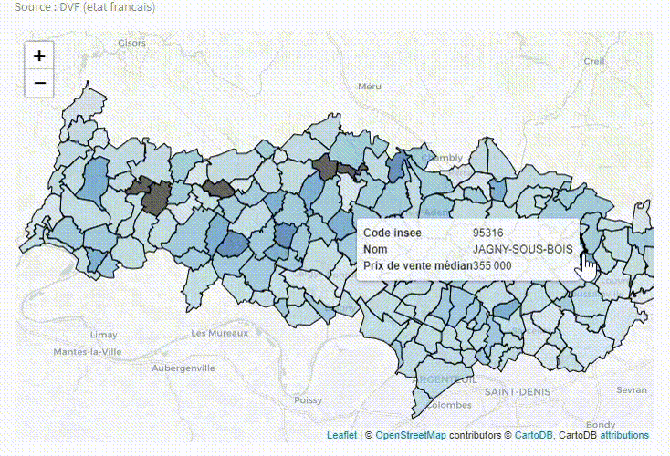

# MESIIN360322_Analyse_DVF

# Statistiques immobilières

Ce code est conçu pour analyser les statistiques immobilières basées sur les données DVF (Demandes de Valeurs Foncières) fournies par l'État français.



## Fonctionnalités

Le code principal offre les fonctionnalités suivantes :

1. Affichage de l'évolution du nombre de transactions par mois pour une commune spécifique ou un département spécifique.
2. Répartition des ventes selon le type de bien pour une commune spécifique ou un département spécifique.
3. Distribution des prix de vente de maisons pour une commune spécifique ou un département spécifique.

## Répartition dans les fichiers

Le code principal est organisé de la manière suivante :

- `cadastre/cadastre-95-communes.json.gz` : Fichier contenant les données cadastrales pour les communes du département 95.
- `cleaned_datasets/` : Dossier contenant les fichiers CSV des données DVF nettoyées pour différentes années (2022, 2021, 2020, 2019, 2018).
- `main.py` : Code principal contenant les fonctionnalités et les visualisations.

## Comment exécuter le code

1. Assurez-vous d'avoir les dépendances suivantes installées : `streamlit`, `folium`, `streamlit_folium`, `gzip`, `json`, `pandas`, `matplotlib`, `numpy`, `plotly.express`.
2. Placez les fichiers `cadastre-95-communes.json.gz` et les fichiers CSV des données DVF nettoyées dans les emplacements spécifiés dans le code.
3. Exécutez la commande suivante dans votre terminal pour lancer l'application :

   ```shell
   streamlit run main.py
